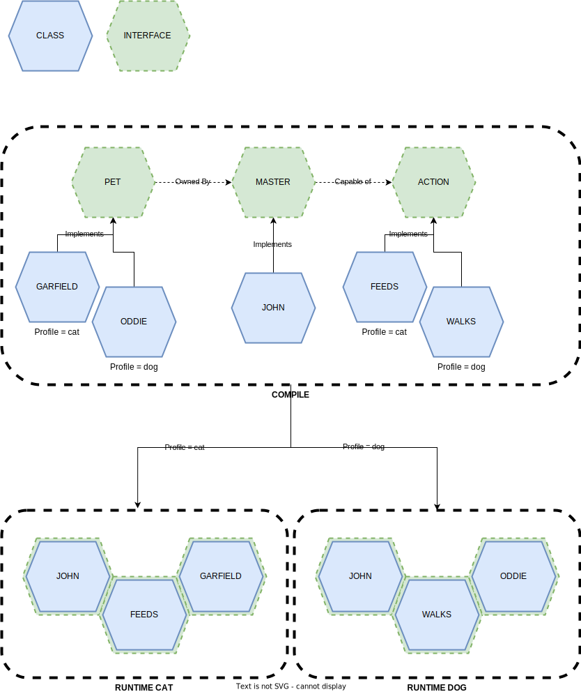

== Spring profiles

* Mark a set of application components as belonging to some  named group
* Such groups can be activated manually on application startup
* Deactivated otherwise (only components without a profile are used by default)

.Profiles
