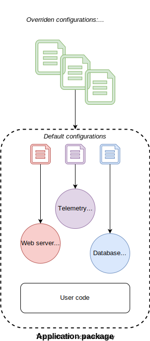

== Spring Boot

Aims at easing application development and packaging:

* _"starter" bundles_ + _Externalized configuration_ + _sensible default values_ = **convention over configuration**

.Spring Boot package and configuration

=== Starters

* Pre-configured feature bundles
* automatic configuration by default
* Overridable by users:
** either by providing configuration variable overrides
** Or by providing their own components (matching interfaces provided by the starter)

=== Externalized configuration

* Users can define a set (or tree) of key/value pairs as:
** type-safe models (pojos / records / data classes)
** injected variable (_@Value_ annotation. Ex: `@Value("${property-name:default-value}")`)
* On deploy, Spring-Boot will fill values by scanning various places:
** Launch command arguments
** java system properties
** environment variables
** embedded configuration files
** etc. (see complete list and order of precedence in link:https://docs.spring.io/spring-boot/docs/current/reference/htmlsingle/#features.external-config[reference documentation])